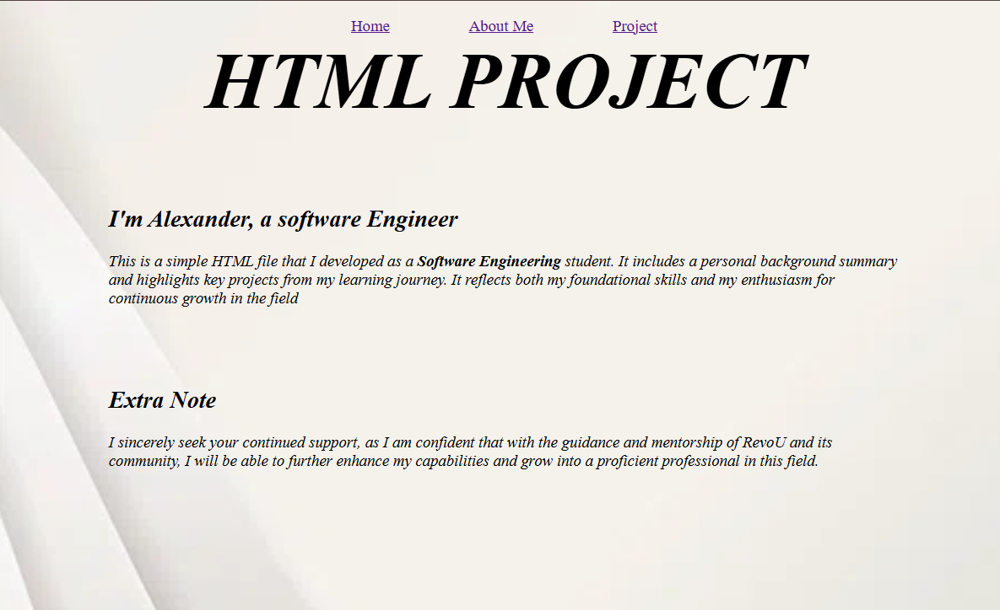
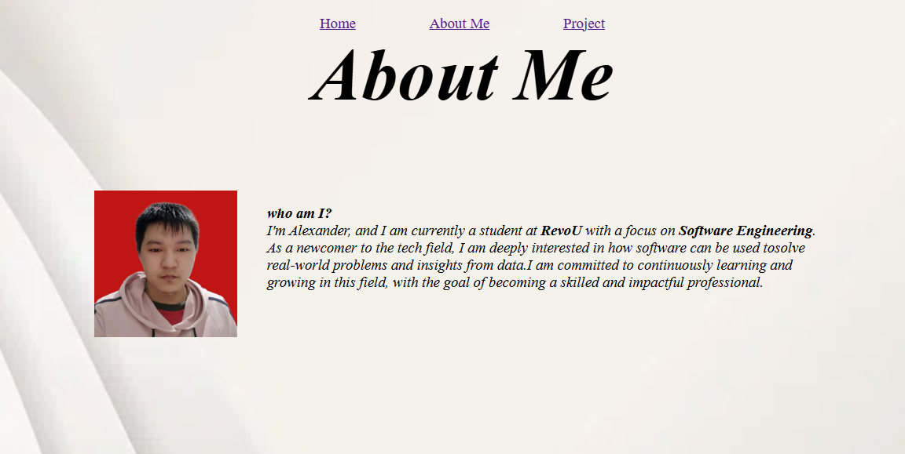
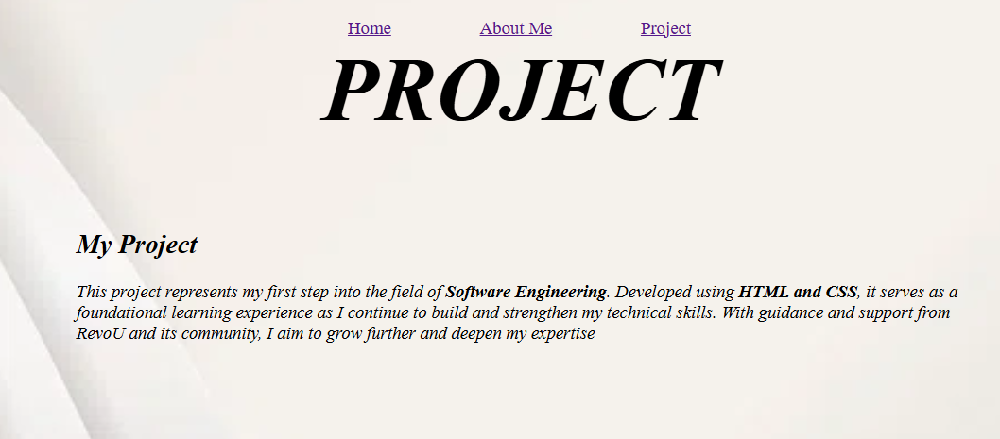

# Milestones Project

This is a simple website created by Alexander as part of a Milestones assignment from *RevoU*.  
The site is built using basic **HTML**, **CSS**, and includes a **local image**.

## Project Overview

This webpage is part of my learning journey at RevoU. It includes:

- **Home**

     A welcome page introducing who I am and what this project is about my start in Software Engineering and my eagerness to keep learning.
  
- **About Me** 

     A brief background about me as a student, my interests in tech, and my goals.  
- **Projects** 

     Showcases this first web project, highlighting the skills I’m developing.  
- **Contact** 

     Ways to get in touch with me via **Email**, **GitHub**, **LinkedIn**, and **WhatsApp**.

## Technologies Used

- HTML  
- CSS

## How to Run Locally

1. Clone the repository.

    copy the url from **code** button (grean)
    open **VS Code** and use command prompt **"git clone url(copy url)"**

2. Open the project folder in **VS Code**.  
3. Use the **Live Server** extension to open the site in your browser.

---

Thanks for checking out my project! I appreciate any support and feedback as I grow my skills.

